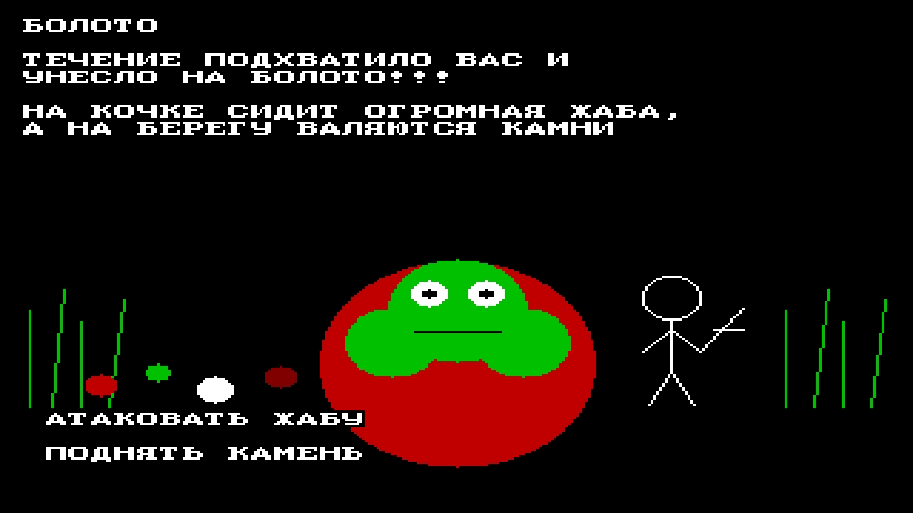
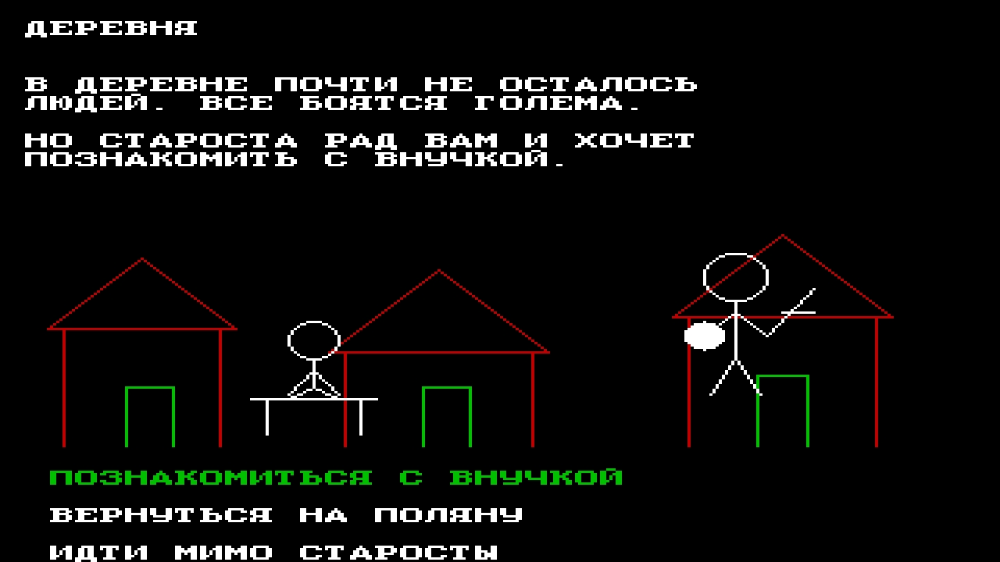
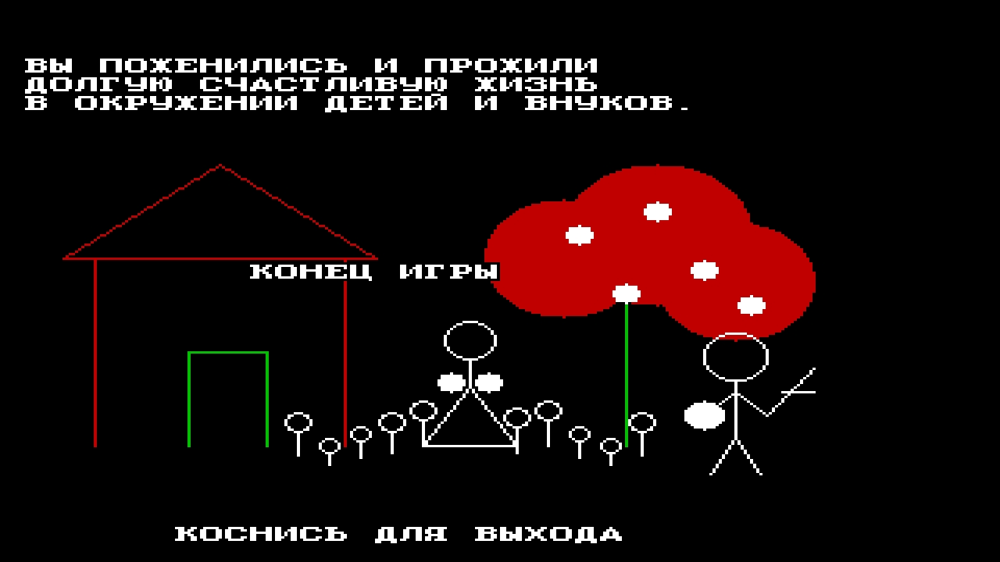
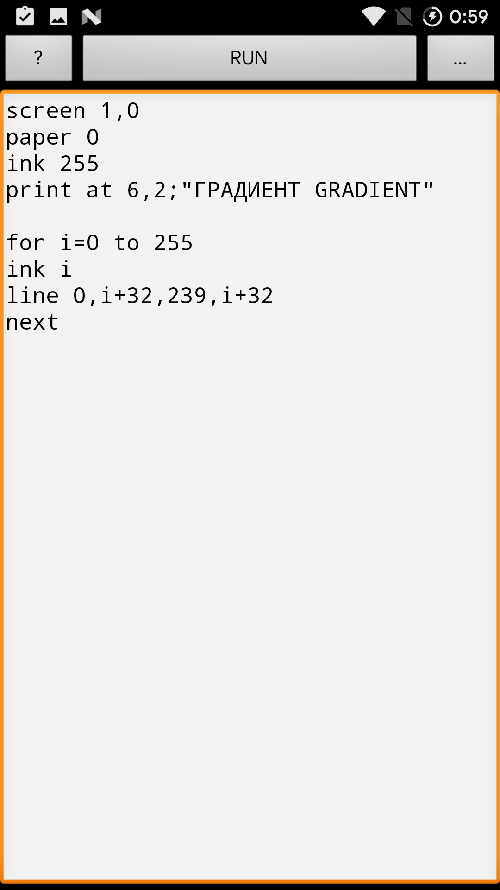
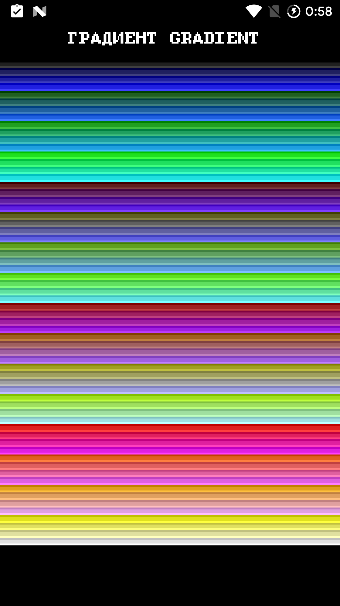
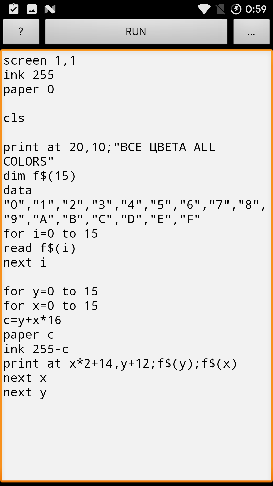
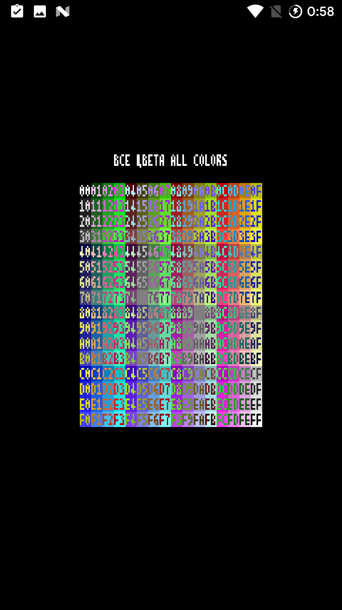
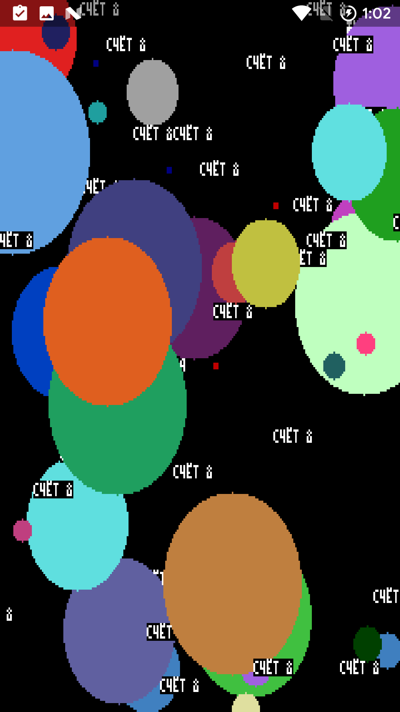
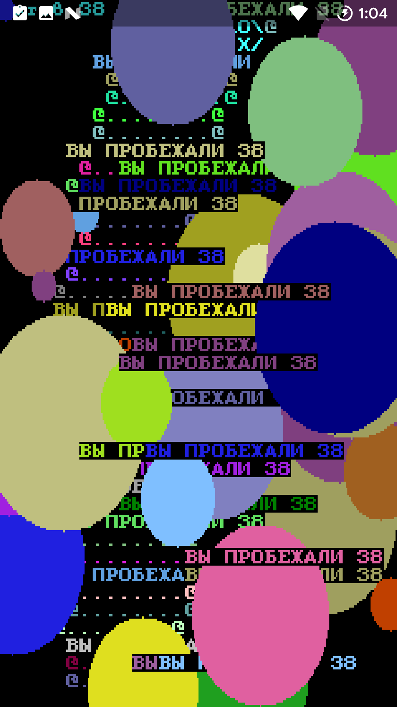
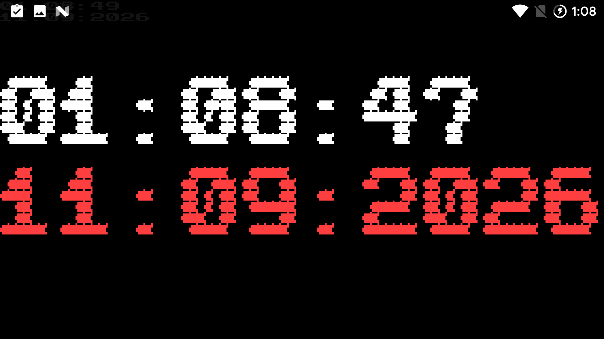

# Examples-BAS

**Games, music and test programs for Naive BASIC 1.0**

A small library of ready-to-run `.bas` programs for the **Naive BASIC** interpreter.
The same sources can also be used as examples and input programs for **Naive BASIC bas2apk / NaiveWORK** when building standalone Android APKs.

## Screenshots / Скриншоты

### Three Talismans / Три талисмана

<table>
<tr>
<td width="33%" align="center"> Swamp / Болото</td>
<td width="33%" align="center"> Village / Деревня</td>
<td width="33%" align="center"> Ending / Финал</td>
</tr>
</table>

### Code → result / Код → результат

<table>
<tr>
<td width="50%" align="center"> Gradient source / Исходник градиента</td>
<td width="50%" align="center"> 256-colour gradient / 256-цветный градиент</td>
</tr>
<tr>
<td width="50%" align="center"> Character-set source / Исходник таблицы символов</td>
<td width="50%" align="center"> Character set / Таблица символов</td>
</tr>
</table>

### Graphics and system data / Графика и системные данные

<table>
<tr>
<td width="33%" align="center"> Graphics demo / Графический пример</td>
<td width="33%" align="center"> Colour graphics / Цветная графика</td>
<td width="33%" align="center"> TIME$ and DATE$ / TIME$ и DATE$</td>
</tr>
</table>

The repository contains more screenshots in `docs/images/`; the gallery above is only a compact selection.

В `docs/images/` находятся и другие скриншоты; выше показана только компактная подборка.

## Contents

### Games

- `dont-touch-red.bas` — touch-screen reaction game: hit green, avoid red.
- `my-cockroach_1-0.bas` — small cockroach game for the compact screen mode.
- `touch_cockroach-1-1.bas` — touch-controlled cockroach variant for the larger character-cell mode.
- `RPG-three-talismans.bas` — text RPG **Three Talismans**.
- `star-trooper.bas` — touch-controlled **Star Catcher** game.

### Music

- `MOTSART_Allegro_8voice_11instruments.bas` — large PLAY demo: Mozart Allegro, 8 voices and multiple instruments.
- `music-play-editor-12.txt.bas` — interactive music/PLAY editor example.
- `nich-yaka-misyachna-text.bas` — music plus on-screen text.
- `happy-day.bas` — colourful musical/visual greeting demo.

### Tests and demos

- `BIG-time-data.bas` — TIME$, DATE$ and graphics demo.
- `charset_1_0.bas` — character-set table in `SCREEN 1,0`.
- `charset_1_1.bas` — character-set table in `SCREEN 1,1`.
- `color-scheme.bas` — 256-colour palette demonstration.
- `gradient.bas` — simple 256-colour gradient test.

## How to use

Download a `.bas` file and open/copy it into Naive BASIC 1.0, or use the same source as an input program for Naive BASIC bas2apk / NaiveWORK.

The files are kept as working examples rather than rewritten showcase versions. Their original filenames are intentionally preserved.

---

# Примеры BASIC

**Игры, музыка и тестовые программы для Naive BASIC 1.0.**

Это небольшая библиотека готовых `.bas`-программ для запуска в интерпретаторе **Naive BASIC**.
Те же исходники можно использовать как примеры и готовые программы для **Naive BASIC bas2apk / NaiveWORK**, превращая их в самостоятельные Android APK.

## Содержимое

### Игры

- `dont-touch-red.bas` — сенсорная игра на реакцию: нажимать зелёное и не трогать красное.
- `my-cockroach_1-0.bas` — маленькая игра с таракашкой для компактного экранного режима.
- `touch_cockroach-1-1.bas` — сенсорный вариант таракашки для режима с более крупным знакоместом.
- `RPG-three-talismans.bas` — текстовая RPG **«Три талисмана»**.
- `star-trooper.bas` — сенсорная игра **«Звёздный ловец»**.

### Музыка

- `MOTSART_Allegro_8voice_11instruments.bas` — большой пример PLAY: Моцарт, Allegro, 8 голосов и несколько инструментов.
- `music-play-editor-12.txt.bas` — пример интерактивного музыкального редактора PLAY.
- `nich-yaka-misyachna-text.bas` — музыка с выводом текста на экран.
- `happy-day.bas` — цветная музыкально-графическая поздравительная демонстрация.

### Тесты и демонстрации

- `BIG-time-data.bas` — демонстрация TIME$, DATE$ и графики.
- `charset_1_0.bas` — таблица символов в режиме `SCREEN 1,0`.
- `charset_1_1.bas` — таблица символов в режиме `SCREEN 1,1`.
- `color-scheme.bas` — демонстрация 256-цветной палитры.
- `gradient.bas` — простой тест 256-цветного градиента.

## Использование

Скачайте нужный `.bas` и откройте/скопируйте его в Naive BASIC 1.0. Тот же исходник можно использовать как входную программу для Naive BASIC bas2apk / NaiveWORK.

Это именно рабочие примеры, а не переписанные специально для витрины версии. Поэтому исходные имена файлов намеренно сохранены.
